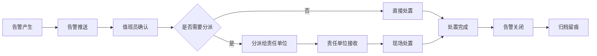

## 1. 产品概述

市级综治中心级联指挥平台是一套面向市级社会治安综合治理中心的Web级联指挥系统，旨在解决跨层级视频资源"看不见、调不动、追不回"的核心问题。平台将辖区内各区县、街道、重点单位的视频资源统一挂接至一张总览图上，实现按层级快速定位、调用和留痕管理。

- **核心目标**：构建统一的视频级联指挥体系，打通市-区-街-重点单位四级视频资源调度通道
- **目标用户**：市级综治中心值班人员、各级指挥调度人员、安保管理人员
- **产品价值**：提升应急响应效率，强化跨部门协同能力，实现视频资源全域可视、可控、可追溯

## 2. 核心功能

### 2.1 用户角色

| 角色 | 注册方式 | 核心权限 |
|------|----------|----------|
| 超级管理员 | 系统初始化 | 全部功能权限，用户管理，系统配置 |
| 市级值班员 | 管理员创建 | 全域视频查看，告警处置，跨部门会商，统计报表 |
| 区级值班员 | 管理员创建 | 本辖区视频查看，告警接收分派，本级统计 |
| 街道操作员 | 管理员创建 | 本街道视频查看，设备状态上报 |
| 重点单位操作员 | 管理员创建 | 本单位视频资源管理，状态上报 |

### 2.2 功能模块

1. **资源接入模块**：视频设备接入管理、设备分组、在线状态监测、设备详情查看
2. **级联管理模块**：级联关系配置、组织树管理、地图总览、分级授权、视频上墙
3. **事件处置模块**：告警管理、告警分派、事件跟踪、历史回溯、跨部门会商
4. **统计报表模块**：设备在线统计、告警统计、处置效率分析、资源使用率统计
5. **权限中心模块**：用户管理、角色管理、权限配置、值班交接、操作审计

### 2.3 页面详情

| 页面名称 | 模块名称 | 功能描述 |
|----------|----------|----------|
| 总览驾驶舱 | 级联管理 | 地图与组织树双视图展示、关键指标卡片、实时告警滚动、快捷操作区 |
| 视频资源管理 | 资源接入 | 设备列表、设备搜索筛选、在线状态监测、设备详情、分组管理 |
| 级联关系配置 | 级联管理 | 组织树管理、级联层级配置、分级授权、资源挂接关系 |
| 视频上墙 | 级联管理 | 视频墙布局、一键上墙、轮巡配置、大屏展示 |
| 告警中心 | 事件处置 | 告警列表、告警详情、告警分派、告警确认、告警关闭 |
| 历史回溯 | 事件处置 | 录像检索、时间轴回放、事件追溯、录像下载 |
| 会商中心 | 事件处置 | 会商房间列表、创建会商、多方视频、会商记录 |
| 统计报表 | 统计报表 | 设备在线率统计、告警趋势分析、处置效率报表、资源使用率 |
| 用户管理 | 权限中心 | 用户列表、新增用户、用户信息编辑、角色分配 |
| 角色权限 | 权限中心 | 角色管理、权限配置、菜单权限、数据权限 |
| 值班交接 | 权限中心 | 交接班记录、交接内容填写、待办事项移交 |
| 操作审计 | 权限中心 | 操作日志、登录日志、审计查询、审计报表 |

## 3. 核心流程

### 3.1 视频资源调度流程

值班人员登录系统后，通过地图或组织树定位目标视频资源，选择视频后一键上墙，在大屏上进行实时监控。当发生告警时，系统自动弹窗提醒，值班人员可快速查看告警详情，分派给相关部门处理，全过程留痕可追溯。

### 3.2 告警处置流程

### 3.3 跨部门会商流程

当重大事件发生时，市级值班员发起会商邀请，各相关部门接入会商，共同研判事件态势，协同制定处置方案，会商全程录像留痕。

## 4. 用户界面设计

### 4.1 设计风格

- **设计定位**：科技感与专业稳重并重的政府级指挥平台风格
- **主色调**：深海蓝（#0A2463）作为主色，体现专业、稳重、可信赖
- **辅助色**：警示红（#E63946）用于告警，成功绿（#2A9D8F）用于在线，警告橙（#F4A261）用于预警
- **中性色**：深灰（#1A1A2E）作为深色背景，浅灰系用于文本层级
- **整体风格**：深色科技风，数据可视化突出，大屏展示友好，操作简洁高效

### 4.2 视觉元素

- **字体**：使用 "Noto Sans SC" 作为中文字体，数字使用等宽字体增强科技感
- **卡片风格**：半透明玻璃拟态效果，微妙边框，精致阴影
- **按钮风格**：圆角8px，主按钮带渐变效果，hover有微动效
- **图标风格**：线性图标，统一2px描边，与文字颜色保持一致
- **数据可视化**：使用ECharts图表，深色主题，动画流畅

### 4.3 布局结构

- **整体布局**：左侧导航栏 + 顶部状态栏 + 主内容区的经典后台布局
- **导航栏**：可折叠，一级菜单带图标，选中高亮
- **顶部栏**：系统名称、告警提醒、用户信息、值班信息
- **内容区**：卡片式布局，支持响应式，关键数据突出展示

### 4.4 页面设计概览

| 页面名称 | 模块名称 | UI元素 |
|----------|----------|--------|
| 总览驾驶舱 | 级联管理 | 地图组件、组织树、指标卡片、告警滚动条、快捷操作按钮、视频预览窗口 |
| 视频资源管理 | 资源接入 | 搜索栏、筛选器、设备列表表格、状态标签、分页器、详情弹窗 |
| 告警中心 | 事件处置 | 告警等级筛选、告警列表、时间筛选、详情面板、分派操作按钮 |
| 统计报表 | 统计报表 | 日期选择器、图表区域、数据表格、导出按钮 |
| 用户管理 | 权限中心 | 用户表格、搜索框、新增按钮、编辑弹窗、角色标签 |

### 4.5 响应式设计

- **桌面优先**：以1920×1080为主要设计尺寸，适配大屏展示
- **大屏适配**：支持2K/4K大屏展示，关键指标可放大显示
- **平板适配**：导航栏可收起，内容区自适应
- **触摸优化**：按钮最小尺寸40×40px，关键操作便于触摸

### 4.6 动效设计

- **页面切换**：淡入淡出过渡，时长200ms
- **卡片悬浮**：轻微上浮 + 阴影加深，过渡150ms
- **数据更新**：数字滚动动画，图表平滑过渡
- **告警提示**：呼吸灯效果 + 轻微震动动画
- **加载状态**：骨架屏 + 脉冲动画
