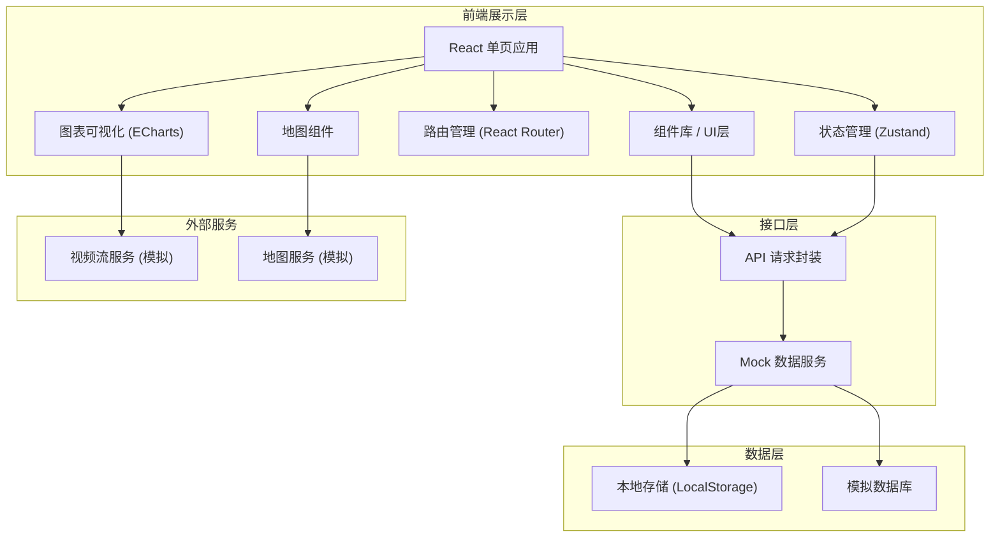

## 1. 架构设计



## 2. 技术描述

- **前端框架**：React@18 + TypeScript@5
- **构建工具**：Vite@5
- **样式方案**：Tailwind CSS@3
- **状态管理**：Zustand@4
- **路由管理**：react-router-dom@6
- **UI图标**：lucide-react
- **图表库**：echarts@5 + echarts-for-react
- **地图组件**：自定义SVG地图组件（模拟）
- **后端**：纯前端项目，使用Mock数据模拟后端接口

## 3. 目录结构

```
src/
├── components/          # 公共组件
│   ├── layout/         # 布局组件
│   ├── ui/             # 基础UI组件
│   ├── charts/         # 图表组件
│   ├── map/            # 地图组件
│   └── tree/           # 组织树组件
├── pages/              # 页面组件
│   ├── dashboard/      # 总览驾驶舱
│   ├── resources/      # 资源接入
│   ├── cascade/        # 级联管理
│   ├── events/         # 事件处置
│   ├── reports/        # 统计报表
│   └── permissions/    # 权限中心
├── store/              # 状态管理
├── hooks/              # 自定义Hooks
├── utils/              # 工具函数
├── types/              # TypeScript类型定义
├── mock/               # Mock数据
├── assets/             # 静态资源
├── App.tsx
├── main.tsx
└── index.css
```

## 4. 路由定义

| 路由路径 | 页面名称 | 模块 |
|----------|----------|------|
| / | 总览驾驶舱 | 级联管理 |
| /dashboard | 总览驾驶舱 | 级联管理 |
| /resources/devices | 视频资源管理 | 资源接入 |
| /resources/groups | 设备分组管理 | 资源接入 |
| /cascade/relation | 级联关系配置 | 级联管理 |
| /cascade/wall | 视频上墙 | 级联管理 |
| /events/alarms | 告警中心 | 事件处置 |
| /events/playback | 历史回溯 | 事件处置 |
| /events/conference | 会商中心 | 事件处置 |
| /reports/overview | 统计总览 | 统计报表 |
| /reports/device | 设备统计 | 统计报表 |
| /reports/alarm | 告警统计 | 统计报表 |
| /permissions/users | 用户管理 | 权限中心 |
| /permissions/roles | 角色权限 | 权限中心 |
| /permissions/handover | 值班交接 | 权限中心 |
| /permissions/audit | 操作审计 | 权限中心 |

## 5. 核心数据模型

### 5.1 设备数据模型

```typescript
interface Device {
  id: string;
  name: string;
  code: string;
  type: 'camera' | 'nvr' | 'encoder';
  status: 'online' | 'offline' | 'warning';
  location: {
    lat: number;
    lng: number;
    address: string;
  };
  orgId: string;
  groupId?: string;
  manufacturer: string;
  model: string;
  ip: string;
  port: number;
  resolution: string;
  hasPTZ: boolean;
  createTime: string;
  lastOnlineTime: string;
}
```

### 5.2 组织数据模型

```typescript
interface Organization {
  id: string;
  name: string;
  code: string;
  level: 1 | 2 | 3 | 4; // 1-市级 2-区级 3-街道 4-重点单位
  parentId: string | null;
  sort: number;
  contact: string;
  phone: string;
  address: string;
  deviceCount: number;
  onlineCount: number;
  children?: Organization[];
}
```

### 5.3 告警数据模型

```typescript
interface Alarm {
  id: string;
  title: string;
  type: 'intrusion' | 'fire' | 'offline' | 'fault' | 'other';
  level: 'critical' | 'major' | 'minor' | 'tip';
  status: 'pending' | 'processing' | 'dispatched' | 'closed';
  deviceId: string;
  deviceName: string;
  orgId: string;
  orgName: string;
  description: string;
  imageUrl?: string;
  createTime: string;
  confirmTime?: string;
  dispatchTime?: string;
  closeTime?: string;
  handler?: string;
  handlerOrg?: string;
  handleResult?: string;
}
```

### 5.4 用户数据模型

```typescript
interface User {
  id: string;
  username: string;
  realName: string;
  avatar?: string;
  phone: string;
  email?: string;
  roleId: string;
  roleName: string;
  orgId: string;
  orgName: string;
  status: 'active' | 'disabled';
  lastLoginTime?: string;
  createTime: string;
}
```

### 5.5 值班交接数据模型

```typescript
interface HandoverRecord {
  id: string;
  shiftType: 'day' | 'night';
  onDutyUserId: string;
  onDutyUserName: string;
  offDutyUserId: string;
  offDutyUserName: string;
  handoverTime: string;
  pendingMatters: string;
  importantEvents: string;
  remarks: string;
  status: 'completed' | 'pending';
}
```

### 5.6 操作审计数据模型

```typescript
interface AuditLog {
  id: string;
  userId: string;
  userName: string;
  orgName: string;
  module: string;
  action: string;
  description: string;
  ip: string;
  userAgent: string;
  createTime: string;
  result: 'success' | 'fail';
}
```

## 6. 状态管理设计

使用 Zustand 进行状态管理，按模块划分 store：

- `useUserStore`：用户信息、登录状态
- `useOrgStore`：组织树数据
- `useDeviceStore`：设备列表、设备详情
- `useAlarmStore`：告警列表、告警统计
- `useUiStore`：UI状态（侧边栏折叠、主题等）

## 7. 核心技术方案

### 7.1 地图展示方案

使用自定义SVG地图组件，支持：
- 区域分层显示
- 设备点位标注
- 状态颜色区分
- 缩放平移
- 点击交互

### 7.2 组织树方案

实现递归树形组件，支持：
- 层级展开/折叠
- 选中高亮
- 设备数量统计
- 在线状态显示
- 搜索过滤

### 7.3 视频上墙方案

使用网格布局实现视频墙：
- 多种布局模板（1/4/9/16分屏）
- 拖拽调整
- 双击全屏
- 轮巡播放

### 7.4 数据可视化方案

使用 ECharts 实现各类图表：
- 折线图：趋势分析
- 柱状图：对比统计
- 饼图：占比分析
- 热力图：区域分布
- 仪表盘：关键指标

## 8. 性能优化方案

- 组件按需渲染，避免不必要重渲染
- 列表虚拟滚动
- 图片懒加载
- 防抖节流处理
- 路由懒加载
- 状态按需订阅
